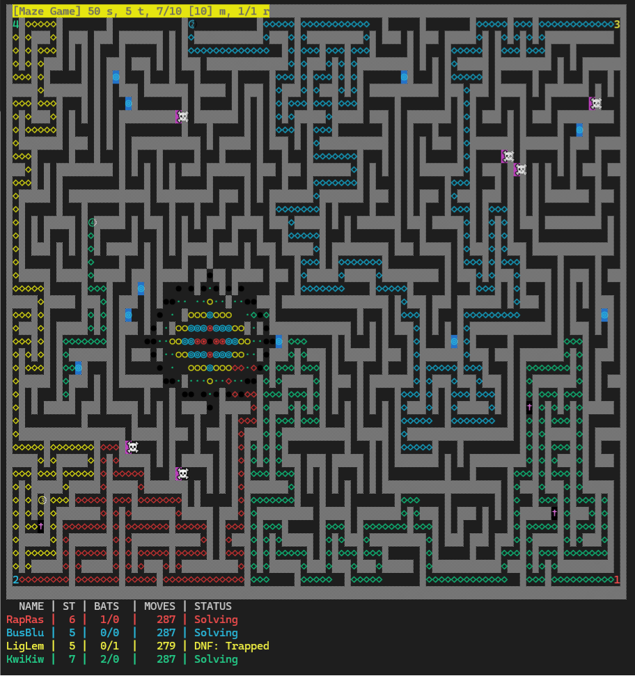

**maze4** is a thrilling, fully autonomous terminal game where genetically-enhanced Fruitbots race through a procedurally generated maze — battling dastardly Veggie Monsters to claim the title of *Supreme Produce*. 🍓⚔️🥦

> _"A chaotic blend of X11 screensaver nostalgia, AI-generated drama, and Jelle's Marble Runs energy — now in your terminal."_

---

## 🎮 What is it?

In the neon-lit jungle of **Nourishvale**, four rival Fruitbots — **Rapid Raspberry**, **Bussin' Blueberry**, **Lightning Lemon**, and **Kwick Kiwi** — must navigate the unpredictable **Maze of Munch**.

Along the way, they’ll:
- ⚔️ Battle sinister veggies like `Brutal Broccoli` and `Creeping Carrot`
- 🌀 Use teleporters to gain an edge (or get hopelessly lost)
- 🎲 Rely on AI-driven strategies to survive and outmaneuver
- 🏆 Compete for glory in a 100% AI-run simulation

No input required. Just launch and enjoy the chaos.

---

## 🧠 AI-Generated?

Yep. The game logic, monster lore, and even this README were crafted with the help of AI large language models — part code, part creativity, all 🍌 bananas.

---

## 🖥️ Screenshot

  
_Above: Kwick Kiwi about to get tenderized by Brutal Broccoli._

---

## 🧪 Features

- Procedurally generated mazes
- Fruitbots with unique names, colors, and battle stats
- 25+ named **Veggie Monsters** (e.g. `Abyssal Artichoke`, `Terror Tomato`)
- ASCII battle animations (optional)
- Teleporters, dead ends, and tactical traps
- In-game real-time status panel
- **Fully autonomous gameplay** — no user control needed
- Inspired by:
  - 🧠 AI code generation
  - 🖼️ Classic X11 maze screensaver
  - 🎥 Jelle’s Marble Runs

---

## 🚀 Installation

### 🔧 Build from source

  git clone https://github.com/chrispollitt/Games.git
  cd maze4
  make

### 📂 Install manpage (optional)

  sudo make install

Then view it with:

  man maze4

## ▶️ Usage

  ./maze4 [OPTIONS]
  Options are:
	
| Option | Meaning |
|--------|---------|
| -t N   | Number of teleporter pairs (default: auto) |
| -m N   | Number of monsters (default: auto) |
| -s N   | Max monster strength (1–15, default: 10) |
| -g N   | Game speed (1–100, default: 50) |
| -k     | Wait for keypress before continuing (default: no) |
| -w     | Show battle windows (default: no) |
| -h     | Show help message |

## ⌨️ In-Game Controls

| Key | Action                        |
|-----|-------------------------------|
| SPC | Pause/Unpause game            |
| q   | Quit game early               |
| +/- | Speed up/Slow down game speed |
| ↑/↓ | Recall past battle results (while game paused) |

## 🥦 Sample Monsters

Brutal Broccoli
Eerie Eggplant
Terror Tomato
Unholy Ube
Nightmare Nori
Zealous Zucchini
(and 20+ more...)

## 💻 Dependencies

Standard C compiler
ncurses library

## 🐛 Bugs / Suggestions

Send bug reports, feature ideas, or your favorite loser bot to:
📬 Chris Pollitt — [chris.pollitt@gmail.com]

## 📜 License

maze4 is free software, licensed under the terms in the source code.

“No warranty — not even for MERCHANTABILITY or FITNESS FOR A PARTICULAR FRUIT.”

## 🍇 Credits

Created by Chris Pollitt
Assisted by AI
Inspired by retro computing, terminal art, and marble sports
